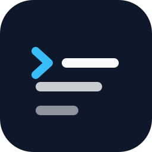

<p align="center">
  
</p>
<h1 align="center">concise</h1>
<p align="center">
  <strong>Structured, concise answers from Claude Code.</strong><br/>
  Answer first. Steps numbered. Nothing to scroll past.
</p>
<p align="center">
  <sub>A fork of <a href="https://github.com/ayghri/i-have-adhd">i-have-adhd</a>, generalized for anyone who wants concise output.</sub>
</p>
<p align="center">
  <a href="LICENSE"></a>
  
</p>

## Install

```bash
claude plugin marketplace add kmizu/concise-plugin
claude plugin install concise@concise
```

Then, inside Claude Code: `/concise`.

## Commands

| Command | Scope | What it does |
| --- | --- | --- |
| `/concise` | This session | Apply the ruleset to every response until you turn it off |
| `/concise:off` | This session | Back to Claude's default style |
| `/concise:always-on` | Every session | Load the ruleset at session start, no command needed |
| `/concise:always-off` | Every session | Undo always-on; the current session is unchanged |
| `/concise:status` | | Is always-on enabled, and where the flag file lives |

Always-on is a single empty file, `~/.claude/.concise-always` (`$CLAUDE_CONFIG_DIR/.concise-always` if you set one). Installing the plugin writes nothing. `/concise:always-on` writes that one file, `/concise:always-off` deletes it. Saying "stop concise mode" does the same as `/concise:off`.

## What changes

<table>
<tr>
<td width="50%">

**Before**

> Great question! Docker build performance can depend on a lot of factors. Looking at your Dockerfile, I notice that you're copying the entire project directory before running `npm ci`, which means that any change to any file invalidates the layer cache and forces a full reinstall of dependencies. One approach would be to copy `package.json` and `package-lock.json` first, run the install, and then copy the rest. You might also want to add a `.dockerignore` file to exclude `node_modules` and other large directories. Hope this helps! Let me know if you'd like me to make these changes.

</td>
<td width="50%">

**After**

> Move `COPY . .` below `RUN npm ci` so the dependency layer caches (`Dockerfile:6`).
>
> 1. Add `COPY package*.json ./` before `RUN npm ci`
> 2. Move `COPY . .` after it
> 3. Rebuild: `docker build .` (the second build skips `npm ci`)
>
> Separately: no `.dockerignore`, so `node_modules` is sent to the daemon. Want that next?

</td>
</tr>
</table>

## The shape

Every response follows the same order. A part appears only when it carries information.

| Part | Content |
| --- | --- |
| **Lead** | The answer, command, path, or next action. The first line. |
| **Steps** | Numbered, one bounded action per item |
| **Detail** | Only what is needed to trust the lead: code blocks for anything runnable, tables for comparisons |
| **State** | `Done: X. Next: Y.` |

Target: one terminal screen. Longer only when you ask to be walked through something.

## The rules

Ten rules. Full text with good/bad examples in [SKILL.md](skills/concise/SKILL.md).

1. Lead with the answer.
2. Number multi-step work.
3. End with one next action.
4. One topic per response.
5. Restate state every turn.
6. Estimates in concrete units.
7. Show results, not effort.
8. Errors: location, cause, fix.
9. Cap lists at five.
10. No preamble, no recap, no closers.

Safety still wins: destructive actions get a confirmation, "explain this" gets a full explanation, real ambiguity gets one question.

## How it works

| File | Role |
| --- | --- |
| `skills/concise/SKILL.md` | The ruleset. `/concise` loads it into the session. |
| `hooks/hooks.json`, `hooks/always-on.mjs` | `SessionStart` hook (startup, resume, clear, compact). When the always-on flag exists it re-injects the ruleset, so the mode survives compaction in long sessions. |
| `commands/*.md` | `/concise:off`, `:always-on`, `:always-off`, `:status`. |
| `hooks/always-on-flag.mjs` | The only code that creates or deletes the flag file. |

Needs Node.js on `PATH` for the hook and the `always-*` commands. Without it the hook fails silently and `/concise` still works per session.

## Customize

Fork, edit `skills/concise/SKILL.md`, then point Claude Code at your fork:

```bash
claude plugin uninstall concise
claude plugin marketplace remove concise
claude plugin marketplace add <you>/<your-fork>
claude plugin install concise@concise
```

Restart Claude Code, then `/concise`.

## Development

```bash
python -m unittest discover -s tests -v   # hook + flag script tests (needs node)
claude plugin validate .                  # manifest check
```

CI installs the plugin from the checkout into a scratch `CLAUDE_CONFIG_DIR` and fails unless `claude plugin list` reports it enabled.

## Acknowledgements

concise is a fork of [i-have-adhd](https://github.com/ayghri/i-have-adhd) by [Ayoub Ghriss](https://github.com/ayghri). The ten rules descend from that work, with thanks. They help any reader, so this fork generalizes them: it is for anyone who wants concise, structured output, whatever the reason. It also narrows the scope to Claude Code and adds the response shape and the command set. For the original, with adapters for a dozen other runtimes and translations in ten languages, use i-have-adhd.

## License

[MIT](LICENSE). Original work © Ayoub Ghriss. Modifications © Kota Mizushima.
